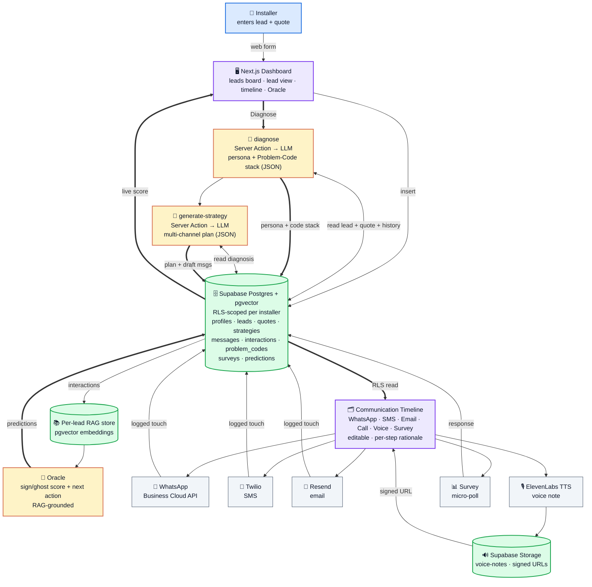

<p align="center">
  
</p>

# ☀️ SolarWarm — AI Engagement & Closing Copilot for Solar Installers

> **Track:** Reonic — *AI-Powered Marketing to Enable Renewable Installers*
> **Event:** {Tech:Europe} AI × Energy Hackathon, Berlin · 20–21 June 2026
>
> We **don't** just generate emails. We turn a solar **quote** into a *diagnosed*,
> persona-matched, **multi-channel closing strategy** — WhatsApp → SMS → email → call →
> voice note → survey — and we tell the installer **exactly why each customer is
> stalling** and what to do next.

> 📋 Full product spec — features, the 40-code taxonomy, schema, build plan, and demo
> script — lives in [`PRD.md`](./PRD.md).

---

## 🎯 The Brief, In One Line

Solar installers lose deals in the gap between **"quote sent"** and **"contract
signed."** Homeowners hesitate, get distracted, get competing offers. Installers have
no time to personalize follow-up at scale, and generic templates don't move the
needle. **Our product reads the customer + quote + interaction history, *diagnoses why
the deal is stalling* (a structured Problem-Code stack), detects the persona, and
produces a coherent multi-channel strategy** — *why this message, in this tone, on this
channel, at this time* — that the installer can preview, edit, and fire off. On top of
that, a predictive **"Oracle"** scores sign-vs-ghost likelihood and names the single
next-best action.

The four personas the brief calls out, which our persona engine maps onto directly —
each with a preferred channel mix and tempo:

| Persona | What they need | Winning frame | Channels · tempo |
|---|---|---|---|
| **Family** | Reassurance, peace of mind | "Predictable bills, no surprises; families nearby did this" | WhatsApp + warm call + voice note · gentle |
| **Investor** | Hard ROI, comparisons | "13% annual return vs. the stock market; 25-yr cashflow table" | Email (data) + SMS nudge · fast, numbers-first |
| **Environmentalist** | Impact narrative | "Offset ~150 t CO₂ over 25 years; energy independence" | Email + WhatsApp story · mission-led |
| **Skeptic** | Objection handling, proof | "Yes, panels work in winter too; license, insurance, 4.8★ reviews" | Call script + documents + low-pressure email · slow, evidence-led |

> Persona is only *half* the diagnosis. The other half is **why this specific lead is
> stuck** — which is the Problem-Code system below.

---

## ⭐ The Problem-Code System (core differentiator)

Persona tells us *who* the customer is; the **Problem Code** tells us *why their deal
is stuck right now*. Every stalled lead is diagnosed into one or more codes from a
**40-code taxonomy across 7 families**, each carrying a recommended counter-strategy,
channel, and message angle. This is what makes the strategy explainable — "why this,
now" — instead of a black box. The taxonomy is grounded in verbatim customer-voice
research across the five languages/markets Reonic serves (DE/EN/NL/FR/IT).

A lead holds a **code stack** — e.g. `P2 + T2 + C1` = *financing-unclear +
unproven-installer + comparison-shopping* — and the AI composes a strategy that
addresses the stack in priority order.

| Family | Covers | Example codes |
|---|---|---|
| **💶 Price & Finance** | sticker shock, unclear financing, subsidy confusion, ROI disbelief, loan-aversion, lock-in fear | `P1`–`P6` |
| **🤝 Trust** | distrust of industry / this installer, scam fear, high-pressure close, faked credentials, bankruptcy fear | `T1`–`T10` |
| **⚔️ Competition** | comparing 2+ quotes, cheaper competitor, competitor pitched faster | `C1`–`C3` |
| **🏠 Fit & Technical** | roof/shading/winter doubt, sizing, add-on uncertainty, renter, re-roof dependency, commissioning failure | `F1`–`F8` |
| **⏳ Life & Timing** | decision inertia, spouse not aligned, waiting on an external event, seasonal/move hesitation | `L1`–`L5` |
| **🛠️ Service & Process** | delivery-time anxiety, poor prior comms, paperwork overwhelm, post-install abandonment, repair-trust | `S1`–`S5` |
| **📡 Engagement Signal** *(auto-derived)* | going cold (ghost risk), re-engaged (strike now), high intent (ready to close) | `E1`–`E3` |

Each code maps to a counter-strategy, a channel, and a message angle — so the generated
sequence is *traceable back to a diagnosed reason*, not a generic template.

---

## 🔮 The "Oracle" — Predictive Next-Best-Action

A *Minority Report*–inspired panel on every lead. Drawing on the lead's per-lead RAG
store (quote, profile, and every logged interaction), the Oracle outputs:

- **Sign probability** and **Ghost risk** (0–100, with trend arrows)
- **Predicted objection** — the Problem Code most likely blocking the signature,
  *before* the customer voices it
- **The one recommended action** — channel + timing + message angle (e.g. *"Send a
  WhatsApp voice note today reframing the monthly rate vs. their current bill — they're
  `P2`-stalled and just re-engaged"*)
- **Confidence + evidence** — which signals drove the prediction, so the manager trusts
  it

Framed honestly as **decision-support, not a crystal ball.** Mechanically: lead history
is embedded into a per-lead vector store and a scoring prompt produces the
probabilities plus the single action, grounded in the retrieved evidence and the active
code stack.

---

## 🌅 The Vision

Reonic gives installers a beautiful funnel — address → 3D house → PV/battery/heat-pump
sizing → a polished offer PDF. **Then the offer is sent, and the funnel goes quiet.**
The single most expensive moment in a solar sale is the silence *after* the quote: the
homeowner is comparing three offers, half-forgetting yours, and the installer — a
small team already booked solid on rooftops — has no time to chase each lead with a
personal, persuasive, well-timed follow-up.

Our product is the **closing layer** that sits on top of that quote. It reads the
homeowner and their numbers, recognizes *who they are* and *what would actually move
them*, and hands the installer a complete, multi-channel persuasion strategy — email,
SMS, a call script, and a personalized voice note — each step annotated with **why it
exists, in what tone, and when to send it.** The installer stays in control: every
message is editable, every rationale is visible. The AI proposes; the human disposes.

**The insight:** generic follow-up templates don't lose deals because they're badly
written — they lose deals because a family and an investor need to hear *completely
different things*, and no installer has time to write four bespoke sequences per lead.
We make persona-tailored, reasoning-backed follow-up a one-click action.

---

## 🧠 How It Works

1. **Installer enters the lead.** A "New Lead" form captures the homeowner (name,
   address, roof type, current monthly bill) and the solar quote (system size in kW,
   total cost, financing type, notes). Saved to Supabase under that installer only.
2. **The AI reads the whole picture.** A Server Action pulls the lead + quote + any
   logged interaction history and sends it to the LLM with a strict JSON-schema prompt.
3. **Diagnosis: persona + Problem-Code stack.** The model classifies the homeowner into
   one of the four archetypes — **family · investor · environmentalist · skeptic** —
   *and* assigns a **Problem-Code stack** (e.g. `P2 + T2 + C1`) naming exactly why the
   deal is stuck, each with confidence and the evidence behind it.
4. **Strategy generation.** It emits a coherent **multi-channel** plan —
   WhatsApp → SMS → Email → Call script → Voice-note script — and for **each** step a
   `timingHint`, a `rationale` (why this channel, this tone, now, for *this* persona and
   *these* codes), and the message body itself.
5. **Visual timeline.** The plan renders as an interactive vertical timeline. Each
   step is a preview card showing its content, its reasoning, and its status — and is
   **click-to-edit** before anything is sent.
6. **One-click execution.** WhatsApp/SMS/email fire via their adapters (real where a
   key exists, gracefully mocked otherwise) and the voice note is synthesized by
   **ElevenLabs**, stored in Supabase Storage, and played back inline from a signed URL.
   Every touch is logged back to the lead, updating its status and feeding the RAG store.
7. **Keep-warm + surveys.** A per-lead cadence engine schedules touches by archetype +
   code + engagement signal: going-cold (`E1`) triggers a re-warm sequence, re-engaged
   (`E2`) escalates to a closing touch, high-intent (`E3`) alerts the manager to call.
   When a code is *uncertain*, a 1-tap micro-survey resolves it and re-routes the strategy.
8. **The Oracle updates live.** Each logged interaction re-scores sign/ghost likelihood
   and refreshes the single recommended next action with its evidence.

The output isn't "here are four emails." It's *"here is the diagnosis, here is the
approach, here is why it fits this customer, and here is how you can adjust it"* — a
persuasion strategy an installer can understand, trust, and iterate on.

---

## 📡 Channels & Keep-Warm Engine

Six touch types, chosen per lead by archetype + code + engagement signal. Each is real
where an API key is present and **gracefully mocked otherwise**, so the demo never
hard-fails.

| Channel | Use | Implementation | Fallback |
|---|---|---|---|
| **WhatsApp** | Warm, high open-rate; family / environmentalist | WhatsApp Business Cloud API | Mock send + preview card |
| **SMS** | Short, time-sensitive nudges; investor | Twilio | Mock toast if no key |
| **Email** | Data, documents, ROI tables; investor / skeptic | Resend | Preview only |
| **Call** | High-touch objection handling; skeptic / family | AI-generated structured call script | Script always shown |
| **Voice note** | Human warmth at scale — the wow moment | ElevenLabs TTS → Supabase Storage → signed URL | Pre-cached MP3 |
| **Survey / micro-poll** | Resolve an uncertain Problem Code | 1-tap WhatsApp/SMS question or 2-click emailed poll | Simulated response in-app |

**Keep-warm logic:** the cadence engine follows up in short windows before
over-analysis sets in; surveys deploy when a code is uncertain (e.g. *"Is it the upfront
cost or the timing giving you pause?"* resolves `P1` vs `L1` and re-routes the strategy).

---

## 🏛️ Architecture



Every table is scoped by `installer_id = auth.uid()` through Row Level Security, so an
installer only ever sees their own leads — the multi-tenant B2B-SaaS shape that answers
the "could this be a company?" question directly. Full schema and execution order live
in [`PRD.md`](./PRD.md) (§9).

---

## 🧱 Tech Stack

> 🏗️ **Production architecture** — this is built as a real, multi-tenant B2B SaaS
> (secure, scalable), not a localStorage demo. Full spec in
> [`PRD.md`](./PRD.md) (§9).

| Layer | Choice |
|---|---|
| **Framework** | Next.js 14+ (App Router), TypeScript, React Server Components |
| **UI** | Tailwind CSS + shadcn/ui + Lucide icons (premium SaaS look) |
| **Database & Auth** | **Supabase** — PostgreSQL + **pgvector**, Auth, Storage, **Row Level Security** |
| **AI** | Vercel AI SDK → OpenAI / Gemini |
| **RAG** | per-lead embedding store (pgvector) feeding diagnosis + the Oracle |
| **Data fetching** | TanStack Query (React Query) or Server Actions |
| **WhatsApp** | WhatsApp Business Cloud API (with mock fallback) |
| **Email** | Resend |
| **SMS** | Twilio (with mock fallback) |
| **Voice note** | ElevenLabs TTS → stored in Supabase Storage (signed URLs) |
| **Toasts** | `sonner` |
| **Deploy** | Vercel |

> 💡 The ElevenLabs voice note also enters us into the **Best Use of Eleven Labs**
> side challenge (6 months Scale tier, ~$1,980/member).
> 🔐 **RLS means installers only ever see their own leads** — the multi-tenant story
> that answers Point Nine's "could this be a company?"

---

## 🧩 Database Schema (Supabase)

Ten objects, with **Row Level Security** so each installer only sees their own data.
Full SQL migration is generated first (see `PRD.md` §9–10 execution order); shape:

| Table | Key columns |
|---|---|
| `profiles` | `id uuid → auth.users`, `company_name`, `created_at` |
| `leads` | `id`, `installer_id → profiles`, `name`, `email`, `phone`, `address`, `roof_type`, `monthly_bill`, `status` (default `new`), `created_at` |
| `quotes` | `id`, `lead_id → leads`, `system_size_kw`, `total_cost`, `financing_type`, `notes` |
| `strategies` | `id`, `lead_id → leads`, `persona_detected`, `strategy_summary`, `created_at` |
| `messages` | `id`, `lead_id`, `strategy_id`, `channel_type` ∈ {whatsapp,sms,email,call,voice,survey}, `content`, `audio_url`, `status` ∈ {draft,sent,failed}, `sent_at`, `error_message` |
| `interactions` | `id`, `lead_id`, `channel`, `direction`, `content`, `sentiment`, `occurred_at` — warm/cold signal + **RAG source** |
| `problem_codes` | `id`, `lead_id`, `code`, `confidence`, `evidence`, `resolved_at` — the **code stack** |
| `surveys` | `id`, `lead_id`, `question`, `channel`, `response`, `asked_at`, `answered_at` |
| `predictions` | `id`, `lead_id`, `sign_prob`, `ghost_risk`, `predicted_code`, `recommended_action`, `evidence`, `created_at` — **Oracle** output |
| **Storage** | bucket `voice-notes` — **private**, owner-only via signed URLs |

RLS policy pattern: every table scoped through `installer_id = auth.uid()` (directly on
`leads`, transitively via `lead_id` on the rest). The persona enum on
`strategies.persona_detected` maps to the brief's four archetypes; `problem_codes.code`
holds the 40-code taxonomy. A `pgvector` per-lead embedding store feeds diagnosis + the
Oracle.

---

## 🚀 Features → Implementation

The brief's features plus our two differentiators, each mapped to what we build on the
Supabase stack.

### 1. Dashboard
Sidebar nav (Dashboard · Leads · Settings) + main area = **Kanban board or data table
of `leads`** (Linear/Vercel dark aesthetic), each card showing name, system size, €,
persona badge, **Problem-Code chips**, engagement state, and the **Oracle risk score** —
sortable by "who needs action today." Server Components read from Supabase (RLS-scoped).
- `app/(app)/dashboard/page.tsx` · `components/sidebar.tsx` · `components/lead-card.tsx`

### 2. Data Entry Forms
A **"New Lead"** modal/page with two sections, saving to `leads` + `quotes`:
- **Homeowner Info** — name, address, email, phone, roof type, monthly bill
- **Solar Quote Info** — system size (kW), total cost, financing type, notes
- shadcn `Form` + `Input` + `Select`; submit via a Server Action that inserts to DB.
- `app/(app)/leads/new/page.tsx` · `components/new-lead-form.tsx`

### 3. AI Diagnosis & Strategy Generator (the core)
Two chained **Server Actions**. First `diagnose.ts` fetches the lead + quote +
interaction history and assigns the **persona + Problem-Code stack** with evidence.
Then `generate-strategy.ts` consumes that diagnosis and emits the multi-channel plan,
persisting into `strategies` (+ draft rows in `messages`).

The prompt is the heart of the product — it must (a) **detect the persona from the
brief's four archetypes** (not freelance ones), (b) **assign a Problem-Code stack** that
explains *why the deal is stuck*, and (c) emit a multi-channel plan with per-step
rationale and timing:

```
SYSTEM: You are an expert solar sales closer. You receive a homeowner profile, a
solar quote, and the interaction history. Do three things:
1. Classify the homeowner into exactly ONE persona: family | investor |
   environmentalist | skeptic. Justify it from the data.
2. Diagnose the stall: assign one or more Problem Codes from the taxonomy
   (P*, T*, C*, F*, L*, S*, E*), each with a confidence and the evidence behind it.
3. Produce a coherent multi-channel strategy to move them from "quote received" to
   "contract signed" — WITHOUT being pushy — that addresses the code stack in
   priority order. Channels available: WhatsApp, SMS, Email, Call script, Voice note.
   For EACH step give: channel, timingHint, rationale (why this channel/tone/now for
   THIS persona AND these codes), and the message body (email also has a subject;
   call/voice are scripts).
Tone, ROI framing, and objection-handling MUST match the persona and the codes.
Output STRICTLY as JSON matching the schema. No prose outside JSON.
```

- Validate with `zod` before the DB insert. UI shows a **skeleton loader** while it runs.
- Constraining persona + codes to enums is what makes the output map onto the judges'
  exact language and keeps the "why" legible and traceable.

### 4. Communication Timeline & Previews
A vertical **timeline** of the steps (WhatsApp → SMS → Email → Call → Voice → Survey),
read from `messages`, with **customer replies interleaved chronologically**. Each step
is a preview card showing its content, its driving Problem Code, and its status, and is
**click-to-expand and editable** before sending:
- **WhatsApp** — text/voice, `Send via WhatsApp` button (mock preview if no key)
- **Email** — subject + body, `Send via Resend` button
- **SMS** — text, `Send via Twilio` button
- **Call** — structured script (Opening · Value Prop · Objection Handling · Close)
- **Voice Note** — `Generate Voice` button → custom audio player streaming from Storage
- `components/timeline.tsx` · `components/step-card.tsx` (edits saved back to `messages`)

### 5. Sending & Voice Pipeline (Server Actions)
- **ElevenLabs** — `app/actions/generate-voice-note.ts`: fetch the voice script from
  `messages` → call TTS (`https://api.elevenlabs.io/v1/text-to-speech/{voice_id}`) →
  convert the audio stream to a **Blob** → upload to Supabase Storage `voice-notes` as
  `{message_id}.mp3` → get a **signed URL** → update `messages.audio_url` + `status='draft'`.
  Player streams the MP3 via the signed URL.
- **WhatsApp** — `send-whatsapp` Server Action via WhatsApp Business Cloud API; **mock
  send + preview card** if no key.
- **Resend** — `send-email` Server Action sends the (possibly edited) body; updates
  `messages.status` to `sent`/`failed` from the API response.
- **Twilio** — `send-sms` Server Action; updates DB status; **mock fallback** if
  `TWILIO_AUTH_TOKEN` is missing, so the demo never hard-fails without a paid number.
- Every send is logged to `interactions` (feeding the RAG store + engagement signals).
- Every Server Action wraps in try/catch and returns `{ error: string }`; buttons show
  spinners while pending; `sonner` toasts on success/failure.

### 6. Problem-Code Diagnosis Engine ⭐
The 40-code taxonomy lives as content (code → counter-strategy → channel → message
angle), grounded in the verbatim customer-voice research. `diagnose.ts` writes the
detected stack into `problem_codes` with confidence + evidence; the dashboard renders
them as chips and the strategy generator consumes them. See PRD §4 for the full table.

### 7. The Oracle — Predictive Next-Best-Action ⭐
`app/actions/score-lead.ts` embeds the lead's interaction history into the per-lead
`pgvector` store and runs a scoring prompt → writes `predictions` (sign prob, ghost
risk, predicted code, recommended action, evidence). The lead view shows a
*Minority Report*–style panel; the dashboard surfaces the risk score as a sortable
column. Re-scores live on every new logged interaction.

### 8. Keep-Warm Cadence + Survey Loop
A per-lead cadence engine schedules touches by archetype + code + engagement signal
(`E1` re-warm, `E2` escalate-to-close, `E3` alert-manager). When a code is uncertain,
`send-survey.ts` issues a 1-tap micro-poll; the ingested response updates the diagnosis
(`surveys` + `problem_codes`) and re-routes the strategy.

---

## 🗺️ Build Order (the 27-hour path)

Production execution order — but **demo wow-path first** if time tightens (see below).

| Step | What |
|---|---|
| **1 — SQL schema** | Generate the full Supabase migration (10 tables/objects + pgvector) + **RLS policies** |
| **2 — Project + middleware** | Next.js structure; `utils/supabase/{client,server,middleware}.ts` for cookie/session |
| **3 — Auth** | Login/Signup (shadcn forms or `@supabase/auth-ui-react`); protected routes |
| **4 — Lead/Quote forms** | New Lead flow → insert to `leads` + `quotes` |
| **5 — Diagnosis** | `diagnose` Server Action → persona + `problem_codes` stack with evidence |
| **6 — AI Strategy** | `generate-strategy` Server Action → `strategies` + draft `messages` |
| **7 — Voice pipeline** | ElevenLabs → Blob → Supabase Storage → signed URL → `messages.audio_url` |
| **8 — Timeline UI** | Preview + edit + send (WhatsApp / SMS / Resend / Twilio); log to `interactions` |
| **9 — Oracle + RAG** | per-lead pgvector store → `score-lead` → `predictions` panel + dashboard column |
| **10 — Keep-warm + surveys** | cadence engine + `send-survey` loop re-routing the diagnosis |

> Install: `@supabase/supabase-js`, `@supabase/ssr` early (step 2). Write
> production-clean, commented code, but protect the **happy path** for the Sunday-14:00
> demo. Freeze features Sunday ~11:00 and spend the rest on polish + the pitch.

---

## 🎬 Demo Flow Checklist (this is the script)

- [ ] Dashboard: leads with archetype badges, **Problem-Code chips**, and **Oracle risk** column — "these deals are stalling, here's why"
- [ ] Open a going-cold lead; **Oracle** reads sign/ghost %, predicted blocker, recommended action
- [ ] Click **Generate Strategy** → diagnosis + multi-channel plan stream in with per-step *why*
- [ ] App shows the **visual timeline** (WhatsApp → SMS → Email → Call → Voice → Survey)
- [ ] Edit the **Voice Note** script → **Generate Voice** → ElevenLabs → **plays the audio** (the wow)
- [ ] Fire the **WhatsApp** touch (real or mocked) → it logs back → engagement flips `E1→E2`, **Oracle updates live**
- [ ] Installer clicks **Send Email** → Resend · **Send SMS** → Twilio (or mock toast)
- [ ] Installer reads the **Call script**

### 🛟 Demo-day insurance
- **Pre-generate & cache one voice note** for the demo lead; run the live ElevenLabs
  call as the show, but have the cached file ready if venue wifi flakes.
- Keep a **recorded fallback video** of the full flow.
- Ensure **loading skeletons** during strategy generation and audio render — the wait
  is part of the UX, not a dead screen.

---

## 🧪 UX/UI Rules

- Modern, **dark-mode-friendly SaaS** aesthetic (Linear / Vercel dashboard).
- `lucide-react` icons · `sonner` toasts ("Email sent", "Voice note generated").
- **Skeletons** while the AI or ElevenLabs is working.
- Timeline steps are **interactive** — click to expand and **edit the AI's text**
  before sending. The installer stays in control; the AI proposes, they dispose.

---

## 🔑 Environment Variables

```bash
# Supabase
NEXT_PUBLIC_SUPABASE_URL=
NEXT_PUBLIC_SUPABASE_ANON_KEY=
SUPABASE_SERVICE_ROLE_KEY=
# AI
OPENAI_API_KEY=
# Voice
ELEVENLABS_API_KEY=
ELEVENLABS_VOICE_ID=
# Email
RESEND_API_KEY=
# SMS (if absent, SMS is mocked)
TWILIO_ACCOUNT_SID=
TWILIO_AUTH_TOKEN=
TWILIO_PHONE_NUMBER=
# WhatsApp (if absent, WhatsApp is mocked)
WHATSAPP_PHONE_NUMBER_ID=
WHATSAPP_ACCESS_TOKEN=
```

Copy `.env.local` from the template. The app degrades gracefully when an integration
key is missing (SMS mocks; voice/email show a clear toast) so the demo never hard-fails.
The `SUPABASE_SERVICE_ROLE_KEY` is server-only — never expose it to the client.

---

## 🏷️ Product Name

Working title: **SolarWarm** — the diagnose-and-keep-warm framing. Alternates from the
team brainstorm: *Momentum, Cadence, Cloze, Chorus, Tailwind, Wingman, Warmline,
Closeline*. Drop your vote in `#team` or open a PR editing this line.

---

## 📊 By the Numbers — What We're Building

> A ~27-hour build window. One production-shaped B2B SaaS, not a throwaway demo.

- **4 personas** — `family` · `investor` · `environmentalist` · `skeptic`, a closed
  enum the AI must classify into (so the output speaks the judges' exact language)
- **40 Problem Codes across 7 families** — the diagnosis taxonomy (`P*·T*·C*·F*·L*·S*·E*`)
  that names *why* each deal is stuck, grounded in 5-language customer-voice research
- **6 channels per strategy** — WhatsApp → SMS → Email → Call → Voice → Survey, each
  with its own timing, rationale, and driving Problem Code
- **10 data objects** — `profiles`, `leads`, `quotes`, `strategies`, `messages`,
  `interactions`, `problem_codes`, `surveys`, `predictions` + a private `voice-notes`
  bucket, all **Row-Level-Security scoped per installer**, with a `pgvector` RAG store
- **1 predictive Oracle** — per-lead sign/ghost scoring + next-best-action with evidence,
  re-scored live on every logged interaction
- **2 chained JSON-schema prompts** — diagnosis (persona + code stack) then strategy
  (multi-channel plan), validated with `zod` before they ever touch the DB
- **4 live integrations** — WhatsApp (Business Cloud API), Resend (email), Twilio (SMS),
  ElevenLabs (voice) — all with graceful mock fallbacks, every touch logged
- **8 seeded demo leads** across all four archetypes and varied code stacks
- **1 side-challenge entry** — the ElevenLabs voice note also competes for **Best Use
  of Eleven Labs** (6 months Scale tier, ~$1,980/member)

---

## 🎯 How It Maps to the Brief

- **Solves the brief's actual problem** — the gap between "quote sent" and "contract
  signed," addressed with strategy and reasoning, not a template dump.
- **Strategically sound** — persona-grounded follow-up, with the *why* visible at every
  step, exactly what the judges said they'd reward.
- **Visually compelling & iterative** — an editable timeline an installer would show
  their sales manager; the installer tweaks tone, timing, and copy on the fly, and
  surveys re-route the diagnosis on the fly.
- **Multi-channel by default** — WhatsApp, SMS, email, call, voice, and survey in one
  strategy (hitting the brief's bonus criteria, not just the baseline).
- **Predictive insights** — the Oracle warns "this customer might ghost" / "ready to
  close now," exactly the bonus the brief names.
- **Something unexpected** — the 40-code diagnosis system + the Oracle answer the
  brief's "an idea we didn't think of that works."
- **Believably a company** — multi-tenant, RLS-secured, production-shaped — the answer
  to "could this be a real product?" with Point Nine in the room.
- **Partner fit** — it bolts directly onto Reonic's existing funnel, picking up exactly
  where their offer PDF leaves off and turning more of those offers into signed deals.

---

## 👥 Team

Built at the {Tech:Europe} AI × Energy Hackathon in Berlin, 20–21 June 2026.

### Ian Baumeister — Product, Strategy & Full-Stack Build

[GitHub `@ibxibx`](https://github.com/ibxibx) · [ianworks.dev](https://ianworks.dev) · Berlin, DE

Solo developer and founder with a background spanning real estate, travel-tech, and
marketing operations — a track record of building startups at the intersection of
physical space and digital product. For this project: product vision, system
architecture, the Supabase + Next.js build, the persona/strategy prompt design, and the
hackathon pitch.

> _Teammates: open a PR adding your name, role, and links here._

---

## 📂 Repo Map

```
README.md            ← you are here (product overview + build plan)
PRD.md               ← full product requirements: features, 40-code taxonomy, schema, demo script
ACTION_PLAN.md       ← team execution plan
AGENTS.md            ← agent/automation notes
apps/                ← Next.js app + Supabase database (monorepo)
packages/            ← shared config
pics/                ← assets
```

---

*Let's turn quotes into contracts. ☀️*
