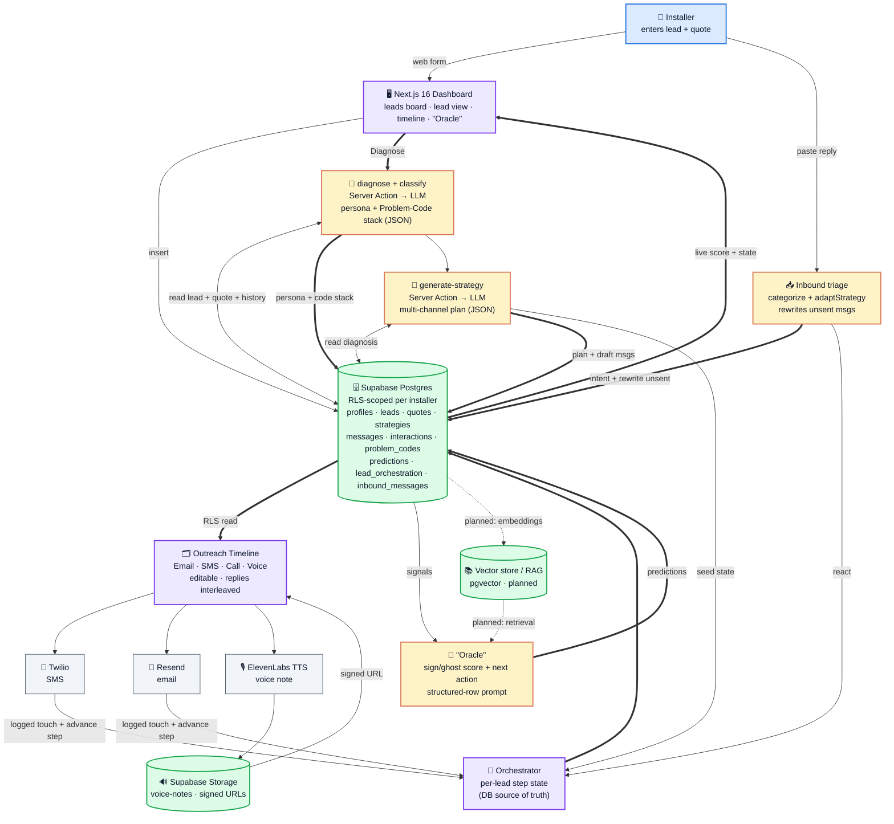

<p align="center">
  
</p>

<h1 align="center">☀️ RayCiprocity</h1>
<p align="center"><strong>AI Sales Copilot for Renewable Installers</strong></p>

> **Track:** Reonic — *AI-Powered Marketing to Enable Renewable Installers*
> **Event:** {Tech:Europe} AI × Energy Hackathon, Berlin · 20–21 June 2026
>
> We **don't** just generate emails. We turn a solar quote into a *diagnosed*,
> persona-matched, **multi-channel closing strategy** — email · SMS · call · voice note —
> tell the installer **exactly why each customer is stalling**, predict whether they'll
> sign or ghost, and **rewrite the outreach automatically** when the customer pushes back.

> 📋 Full product spec — features, the [40-code taxonomy](./prd/PRD.md), schema, demo script — lives in
> [`prd/PRD.md`](./prd/PRD.md). Live build plan and shipped status in
> [`ACTION_PLAN.md`](./ACTION_PLAN.md).

---

## 🎯 The Brief, In One Line

Solar installers lose deals in the gap between **"quote sent"** and **"contract
signed."** Homeowners hesitate, get distracted, get competing offers. Installers have
no time to personalize follow-up at scale, and generic templates don't move the
needle. **Our product reads the customer + quote + interaction history, *diagnoses why
the deal is stalling* (a structured Problem-Code stack), detects the persona, and
produces a coherent multi-channel strategy** — *why this message, in this tone, on this
channel, at this time* — that the installer can preview, edit, and fire off. On top of
that, a predictive **"Oracle"** scores sign-vs-ghost likelihood and names the single
next-best action.

The four personas the brief calls out, which our persona engine maps onto directly —
each with a preferred channel mix and tempo:

| Persona | What they need | Winning frame | Channels · tempo |
|---|---|---|---|
| **Family** | Reassurance, peace of mind | "Predictable bills, no surprises; families nearby did this" | WhatsApp + warm call + voice note · gentle |
| **Investor** | Hard ROI, comparisons | "13% annual return vs. the stock market; 25-yr cashflow table" | Email (data) + SMS nudge · fast, numbers-first |
| **Environmentalist** | Impact narrative | "Offset ~150 t CO₂ over 25 years; energy independence" | Email + WhatsApp story · mission-led |
| **Skeptic** | Objection handling, proof | "Yes, panels work in winter too; license, insurance, 4.8★ reviews" | Call script + documents + low-pressure email · slow, evidence-led |

> Persona is only *half* the diagnosis. The other half is **why this specific lead is
> stuck** — which is the Problem-Code system below.

---

## ⭐ The Problem-Code System (core differentiator)

Persona tells us *who* the customer is; the **Problem Code** tells us *why their deal
is stuck right now*. Every stalled lead is diagnosed into one or more codes from a
**[40-code taxonomy](./prd/PRD.md) across 7 families**, each carrying a recommended counter-strategy,
channel, and message angle. This is what makes the strategy explainable — "why this,
now" — instead of a black box. The taxonomy is grounded in verbatim customer-voice
research across the five languages/markets Reonic serves (DE/EN/NL/FR/IT).

A lead holds a **code stack** — e.g. `P2 + T2 + C1` = *financing-unclear +
unproven-installer + comparison-shopping* — and the AI composes a strategy that
addresses the stack in priority order.

| Family | Covers | Example codes |
|---|---|---|
| **💶 Price & Finance** | sticker shock, unclear financing, subsidy confusion, ROI disbelief, loan-aversion, lock-in fear | `P1`–`P6` |
| **🤝 Trust** | distrust of industry / this installer, scam fear, high-pressure close, faked credentials, bankruptcy fear | `T1`–`T10` |
| **⚔️ Competition** | comparing 2+ quotes, cheaper competitor, competitor pitched faster | `C1`–`C3` |
| **🏠 Fit & Technical** | roof/shading/winter doubt, sizing, add-on uncertainty, renter, re-roof dependency, commissioning failure | `F1`–`F8` |
| **⏳ Life & Timing** | decision inertia, spouse not aligned, waiting on an external event, seasonal/move hesitation | `L1`–`L5` |
| **🛠️ Service & Process** | delivery-time anxiety, poor prior comms, paperwork overwhelm, post-install abandonment, repair-trust | `S1`–`S5` |
| **📡 Engagement Signal** *(auto-derived)* | going cold (ghost risk), re-engaged (strike now), high intent (ready to close) | `E1`–`E3` |

Each code maps to a counter-strategy, a channel, and a message angle — so the generated
sequence is *traceable back to a diagnosed reason*, not a generic template.

---

## 🔮 The "Oracle" — Predictive Next-Best-Action

A panel on every lead. Drawing on the lead's quote, persona,
problem-code stack, and logged interaction signals, the "Oracle" outputs:

- **Sign probability** and **Ghost risk** (0–100, with trend arrows)
- **Predicted objection** — the Problem Code most likely blocking the signature,
  *before* the customer voices it
- **The one recommended action** — channel + timing + message angle (e.g. *"Send a
  voice note today reframing the monthly rate vs. their current bill — they're
  `P2`-stalled and just re-engaged"*)
- **Confidence + evidence** — which signals drove the prediction, so the manager trusts
  it

Framed honestly as **decision-support, not a crystal ball.** Mechanically: the lead's
quote, persona, problem-code stack, and interaction signals are fed as structured rows
straight into a scoring prompt that returns the probabilities plus the single action
with its evidence. For the hackathon build we feed structured rows directly (fast,
cheap, and plenty at this scale); a **per-lead vector store / RAG layer is planned** to
let the "Oracle" reason over the full free-text interaction history as volume grows.

---

## 🔁 The Orchestrator — Live Strategy-Execution State

A strategy is only useful if someone knows *where each lead is in it right now*. The
**Orchestrator** is a per-lead state machine, with the database as the source of truth,
that tracks which step of the multi-channel sequence a lead is on and what happens next:

- Each lead carries a state — `not_started → in_progress → awaiting_reply → completed`
  (or `paused`) — plus `current_step / total_steps` and a `next_action_at` timestamp.
- The lead view shows it plainly: *"Step 2 of 4 · awaiting reply · next touch due today,"*
  and surfaces the **next step's actual message and its "why now" goal**.
- It's **live-wired to the real send flow**: generating a strategy auto-seeds the state,
  and every successful email/SMS send **auto-advances the step** — the orchestrator
  drives and reflects the actual outreach, it isn't a static diagram.

This is the difference between "here's a plan" and "here's the plan, and here's the one
thing to do for this lead today."

---

## 📥 Inbound Triage + Automatic Outreach Pivot

The feature that turns a one-way sequence into a real conversation. When a customer
replies, the reply **lands on the dashboard**, and:

1. **The AI categorizes the intent** — `interested · objection · ghost_risk ·
   ready_to_close` — with reasoning and a suggested next step, persisted to the lead.
2. **The Orchestrator reacts** — an objection holds the sequence, a ghost-risk pauses it,
   a ready-to-close flips it toward the closing touch.
3. **The outreach actually rewrites itself** — every remaining *unsent* message is
   regenerated to convincingly tackle the customer's specific concern
   (acknowledge-then-address, in the persona's tone, inventing no fake numbers). A
   winter-production objection, for example, rewrites the upcoming SMS, call, and voice
   note to address diffused-light performance and financing.
4. **The reply is interleaved into the timeline** — customer-side entries render
   chronologically, so the back-and-forth reads as one thread.

This is the strongest demo beat: paste a real objection, and watch the whole downstream
strategy re-aim itself at it in seconds.

---

## 🧬 Archetype Classifier (first-pass agent)

A standalone, stateless agent that takes a raw lead and returns a single archetype —
`family · investor · environmentalist · skeptic` — with a confidence score, the signals
it keyed on, and its reasoning. It runs as the first pass before a full strategy is
defined, so persona is locked (and visible) from the very first touch.

---

## 🌅 The Vision

Reonic gives installers a beautiful funnel — address → 3D house → PV/battery/heat-pump
sizing → a polished offer PDF. **Then the offer is sent, and the funnel goes quiet.**
The single most expensive moment in a solar sale is the silence *after* the quote: the
homeowner is comparing three offers, half-forgetting yours, and the installer — a
small team already booked solid on rooftops — has no time to chase each lead with a
personal, persuasive, well-timed follow-up.

Our product is the **closing layer** that sits on top of that quote. It reads the
homeowner and their numbers, recognizes *who they are* and *what would actually move
them*, and hands the installer a complete, multi-channel persuasion strategy — email,
SMS, a call script, and a personalized voice note — each step annotated with **why it
exists, in what tone, and when to send it.** The installer stays in control: every
message is editable, every rationale is visible. The AI proposes; the human disposes.

**The insight:** generic follow-up templates don't lose deals because they're badly
written — they lose deals because a family and an investor need to hear *completely
different things*, and no installer has time to write four bespoke sequences per lead.
We make persona-tailored, reasoning-backed follow-up a one-click action.

---

## 🧠 How It Works

1. **Installer enters the lead.** A "New Lead" form captures the homeowner (name,
   address, roof type, current monthly bill) and the solar quote (system size in kW,
   total cost, financing type, notes). Saved to Supabase under that installer only.
2. **The AI reads the whole picture.** A Server Action pulls the lead + quote + any
   logged interaction history and sends it to the LLM with a strict JSON-schema prompt.
3. **Diagnosis: persona + Problem-Code stack.** The model classifies the homeowner into
   one of the four archetypes — **family · investor · environmentalist · skeptic** —
   *and* assigns a **Problem-Code stack** (e.g. `P2 + T2 + C1`) naming exactly why the
   deal is stuck, each with confidence and the evidence behind it.
4. **Strategy generation.** It emits a coherent **multi-channel** plan —
   Email → SMS → Call script → Voice-note script — and for **each** step a
   `timingHint`, a `rationale` (why this channel, this tone, now, for *this* persona and
   *these* codes), and the message body itself.
5. **Visual timeline.** The plan renders as an interactive vertical timeline. Each
   step is a preview card showing its content, its reasoning, and its status — and is
   **click-to-edit** before anything is sent.
6. **One-click execution.** Email/SMS fire via their adapters (real where a key exists,
   gracefully mocked otherwise), the call script is shown, and the voice note is
   synthesized by **ElevenLabs**, stored in Supabase Storage, and played back inline from
   a signed URL. Every send logs an interaction and **auto-advances the Orchestrator step**.
7. **Inbound triage + pivot.** When the customer replies, the AI categorizes the intent
   (interested · objection · ghost_risk · ready_to_close), the Orchestrator reacts, and
   **every remaining unsent message rewrites itself** to address the concern — the reply
   is interleaved into the timeline as a customer-side entry.
8. **The "Oracle" updates.** Sign/ghost likelihood and the single recommended next action
   are re-scored from the lead's quote, codes, and interaction signals, with evidence.

The output isn't "here are four emails." It's *"here is the diagnosis, here is the
approach, here is why it fits this customer, and here is how you can adjust it"* — a
persuasion strategy an installer can understand, trust, and iterate on.

---

## 📡 Channels

Four touch types per strategy, chosen per lead by archetype + problem-code stack. Each
is real where an API key is present and **gracefully mocked otherwise** (`MOCK_EMAIL` /
`MOCK_SMS` flags), so the demo never hard-fails.

| Channel | Use | Implementation | Fallback |
|---|---|---|---|
| **Email** | Data, documents, ROI tables; investor / skeptic | Resend | Mock / preview |
| **SMS** | Short, time-sensitive nudges; investor | Twilio | Mock toast if no key |
| **Call** | High-touch objection handling; skeptic / family | AI-generated structured call script | Script always shown |
| **Voice note** | Human warmth at scale — the wow moment | ElevenLabs TTS → Supabase Storage → signed URL | Pre-cached MP3 |

> **Roadmap channels (designed, not yet built):** WhatsApp (Business Cloud API) for warm,
> high-open-rate touches, and a Survey / micro-poll channel to resolve an uncertain
> Problem Code (*"Is it the upfront cost or the timing giving you pause?"* — resolves
> `P1` vs `L1` and re-routes the strategy). Both are specced in [`prd/PRD.md`](./prd/PRD.md) §6.

---

## 🏛️ Architecture



Every table is scoped by `installer_id = auth.uid()` through Row Level Security, so an
installer only ever sees their own leads — the multi-tenant B2B-SaaS shape that answers
the "could this be a company?" question directly. Full schema lives in
[`prd/PRD.md`](./prd/PRD.md) (§9); shipped status in [`ACTION_PLAN.md`](./ACTION_PLAN.md).

---

## 🧱 Tech Stack

> 🏗️ **Production architecture** — this is built as a real, multi-tenant B2B SaaS
> (secure, scalable), not a localStorage demo. Full spec in
> [`prd/PRD.md`](./prd/PRD.md) (§9).

| Layer | Choice |
|---|---|
| **Framework** | Next.js 16 (App Router, RSC, Turbopack), TypeScript, React 19 |
| **UI** | Tailwind CSS + shadcn/ui + Lucide icons (premium SaaS look) |
| **Database & Auth** | **Supabase** — PostgreSQL, Auth, Storage, **Row Level Security** |
| **AI** | Vercel AI SDK → OpenAI (`gpt-4o`, strict JSON-schema mode) |
| **RAG** *(planned)* | per-lead vector store (pgvector) to ground the "Oracle" + diagnosis in full interaction history |
| **Data fetching** | `next-safe-action` Server Actions + TanStack Query |
| **Email** | Resend (with `MOCK_EMAIL` fallback) |
| **SMS** | Twilio (with `MOCK_SMS` fallback) |
| **Voice note** | ElevenLabs TTS → stored in Supabase Storage (signed URLs) |
| **Charts** | Recharts (Oracle gauges) |
| **Toasts** | `sonner` |
| **Monorepo / Deploy** | Turborepo + pnpm · Vercel |

> 🔐 **RLS means installers only ever see their own leads** — multi-tenant by design.

---

## 🧩 Database Schema (Supabase)

**Row Level Security** scopes every table so each installer only sees their own data.
Full SQL lives as timestamped migrations under `apps/database/supabase/migrations`; shape:

| Table | Key columns |
|---|---|
| `profiles` | `id uuid → auth.users`, `company_name`, `created_at` |
| `leads` | `id`, `installer_id → profiles`, `name`, `email`, `phone`, `address`, `roof_type`, `monthly_bill`, `status` ∈ {new,contacted,negotiating,closed,ghosted}, `created_at` |
| `quotes` | `id`, `lead_id → leads`, `system_size_kw`, `total_cost`, `financing_type`, `notes` |
| `strategies` | `id`, `lead_id → leads`, `persona_detected`, `strategy_summary`, `created_at` |
| `messages` | `id`, `lead_id`, `strategy_id`, `channel_type` ∈ {email,sms,call,voice}, `content`, `audio_url`, `status` ∈ {draft,sent,failed}, `sent_at`, `error_message` |
| `interactions` | `id`, `lead_id`, `channel`, `direction`, `content`, `sentiment`, `occurred_at` — warm/cold signal |
| `problem_codes` | `id`, `lead_id`, `code`, `family`, `confidence`, `evidence`, `resolved_at` — the **code stack** |
| `predictions` | `id`, `lead_id`, `sign_prob`, `ghost_risk`, `predicted_code`, `recommended_action`, `evidence`, `created_at` — **Oracle** output |
| `lead_orchestration` | `lead_id`, `strategy_id`, `current_step`, `total_steps`, `status`, `next_action_at`, `updated_at` — **Orchestrator** state |
| `inbound_messages` | `id`, `lead_id`, `content`, `intent`, `reasoning`, `suggested_step`, `created_at` — **inbound triage** |
| **Storage** | bucket `voice-notes` — **private**, owner-only via signed URLs |

RLS policy pattern: every table scoped through `installer_id = auth.uid()` (directly on
`leads`, transitively via `lead_id` on the rest). The persona enum on
`strategies.persona_detected` maps to the brief's four archetypes; `problem_codes.code`
holds the 40-code taxonomy. *(The `surveys` table is specced in `prd/PRD.md` §9 as roadmap,
not yet built.)*

---

## 🚀 Features → Implementation

The brief's features plus our two differentiators, each mapped to what we build on the
Supabase stack.

### 1. Dashboard
Sidebar nav (Dashboard · Leads · Settings) + main area = **Kanban board or data table
of `leads`** (Linear/Vercel dark aesthetic), each card showing name, system size, €,
persona badge, **Problem-Code chips**, engagement state, and the **Oracle risk score** —
sortable by "who needs action today." Server Components read from Supabase (RLS-scoped).
- `app/(app)/dashboard/page.tsx` · `components/sidebar.tsx` · `components/lead-card.tsx`

### 2. Data Entry Forms
A **"New Lead"** modal/page with two sections, saving to `leads` + `quotes`:
- **Homeowner Info** — name, address, email, phone, roof type, monthly bill
- **Solar Quote Info** — system size (kW), total cost, financing type, notes
- shadcn `Form` + `Input` + `Select`; submit via a Server Action that inserts to DB.
- `app/(app)/leads/new/page.tsx` · `components/new-lead-form.tsx`

### 3. AI Diagnosis & Strategy Generator (the core)
Two chained **Server Actions**. First `diagnose.ts` fetches the lead + quote +
interaction history and assigns the **persona + Problem-Code stack** with evidence.
Then `generate-strategy.ts` consumes that diagnosis and emits the multi-channel plan,
persisting into `strategies` (+ draft rows in `messages`).

The prompt is the heart of the product — it must (a) **detect the persona from the
brief's four archetypes** (not freelance ones), (b) **assign a Problem-Code stack** that
explains *why the deal is stuck*, and (c) emit a multi-channel plan with per-step
rationale and timing:

```
SYSTEM: You are an expert solar sales closer. You receive a homeowner profile, a
solar quote, and the interaction history. Do three things:
1. Classify the homeowner into exactly ONE persona: family | investor |
   environmentalist | skeptic. Justify it from the data.
2. Diagnose the stall: assign one or more Problem Codes from the taxonomy
   (P*, T*, C*, F*, L*, S*, E*), each with a confidence and the evidence behind it.
3. Produce a coherent multi-channel strategy to move them from "quote received" to
   "contract signed" — WITHOUT being pushy — that addresses the code stack in
   priority order. Channels available: Email, SMS, Call script, Voice note.
   For EACH step give: channel, timingHint, rationale (why this channel/tone/now for
   THIS persona AND these codes), and the message body (email also has a subject;
   call/voice are scripts).
Tone, ROI framing, and objection-handling MUST match the persona and the codes.
Output STRICTLY as JSON matching the schema. No prose outside JSON.
```

- Validate with `zod` before the DB insert (OpenAI strict mode → every key `required`,
  use `.nullable()` not `.optional()`). UI shows a **skeleton loader** while it runs.
- Constraining persona + codes to enums is what makes the output map onto the judges'
  exact language and keeps the "why" legible and traceable.

### 4. Outreach Timeline & Previews
A vertical **timeline** of the steps (Email → SMS → Call → Voice), read from `messages`,
with **customer replies interleaved chronologically**. Each step is a preview card
showing its content, its driving Problem Code, and its status, and is
**click-to-edit (pencil)** before sending (edits blocked once a message is sent):
- **Email** — subject + body, `Send via Resend` button
- **SMS** — text, `Send via Twilio` button
- **Call** — structured script (Opening · Value Prop · Objection Handling · Close)
- **Voice Note** — `Generate Voice` button → custom audio player streaming from Storage
- `components/strategy/strategy-timeline.tsx` · `timeline-step.tsx` · `inbound-timeline-entry.tsx`

### 5. Sending & Voice Pipeline (Server Actions)
- **ElevenLabs** — fetch the voice script → call TTS → convert the audio stream to a
  **Blob** → upload to Supabase Storage `voice-notes` as `{message_id}.mp3` → get a
  **signed URL** → update `messages.audio_url`. Player streams the MP3 via the signed URL.
- **Resend** — `send-email` sends the (possibly edited) body; updates `messages.status`
  to `sent`/`failed`; `MOCK_EMAIL` fallback so the demo never hard-fails.
- **Twilio** — `send-sms`; updates DB status; `MOCK_SMS` fallback if no paid number.
- Every send logs an `interactions` row **and auto-advances the Orchestrator step**.
- Every Server Action wraps in try/catch and returns `{ error: string }`; buttons show
  spinners while pending; `sonner` toasts on success/failure.

### 6. Problem-Code Diagnosis Engine ⭐
The [40-code taxonomy](./prd/PRD.md) lives as content (code → counter-strategy → channel → message
angle), grounded in the verbatim customer-voice research. `diagnose.ts` writes the
detected stack into `problem_codes` with confidence + evidence; the dashboard renders
them as chips and the strategy generator consumes them. See the [full 40-code table](./prd/PRD.md) (PRD §4).

### 7. The "Oracle" — Predictive Next-Best-Action ⭐
`generateOracle(leadId)` feeds the lead's quote, persona, code stack, and interaction
signals as structured rows into a scoring prompt → writes `predictions` (sign prob,
ghost risk, predicted blocker, recommended action, evidence). The lead view shows a
*Minority Report*–style panel with two recharts gauges and a "one recommended action"
CTA that jumps to that channel's step. (Structured rows today; a vector/RAG layer is
**planned** — see Roadmap.)

### 8. The Orchestrator — Live Strategy-Execution State ⭐
`data/user/orchestration.ts` + `lib/orchestration-core.ts`: a DB-backed per-lead state
machine (`lead_orchestration`). Generating a strategy seeds the state; each send
`bumpStep`s it forward; the lead view shows *"Step 2 of 4 · awaiting reply · next touch
due today"* plus the next step's actual message and "why now" goal. Deterministic, no
model call.

### 9. Inbound Triage + Automatic Outreach Pivot ⭐
`data/user/inbound.ts` + `components/strategy/inbound-panel.tsx`: paste a customer reply
→ `categorizeInbound` tags intent (interested · objection · ghost_risk · ready_to_close)
→ the Orchestrator reacts → **`adaptStrategy` rewrites every remaining unsent message**
to address the concern in persona tone (no invented numbers). The reply interleaves into
the timeline. The strongest demo beat.

### 10. Archetype Classifier
`data/user/classify-archetype.ts` + `classifyArchetype` in `lib/ai/provider.ts`: a
stateless first-pass agent returning a single archetype + confidence + signals +
reasoning, so persona is locked before a full strategy is generated.

> **Roadmap (specced, not built):** a per-lead **vector store / RAG layer** (pgvector)
> to ground the "Oracle" and diagnosis in full free-text history, the keep-warm cadence
> engine, the survey loop (FR-6), the WhatsApp channel, and DE/EN A/B strategy variants —
> see [`prd/PRD.md`](./prd/PRD.md) §6 and [`ACTION_PLAN.md`](./ACTION_PLAN.md) Phase 5.

---

## 🗺️ Build Order (the 27-hour path)

Production execution order — but **demo wow-path first** if time tightens (see below).

| Step | What |
|---|---|
| **1 — SQL schema** | Supabase migrations (10 tables) + **RLS policies** |
| **2 — Project + middleware** | Next.js structure; `utils/supabase/{client,server,middleware}.ts` for cookie/session |
| **3 — Auth** | Login/Signup (shadcn forms or `@supabase/auth-ui-react`); protected routes |
| **4 — Lead/Quote forms** | New Lead flow → insert to `leads` + `quotes` |
| **5 — Diagnosis** | `diagnose` Server Action → persona + `problem_codes` stack with evidence |
| **6 — AI Strategy** | `generate-strategy` Server Action → `strategies` + draft `messages` |
| **7 — Voice pipeline** | ElevenLabs → Blob → Supabase Storage → signed URL → `messages.audio_url` |
| **8 — Timeline UI** | Preview + edit + send (Email / SMS / Voice); log to `interactions` + advance Orchestrator |
| **9 — Oracle** | structured-row scoring → `score-lead` → `predictions` panel + gauges |
| **10 — Orchestrator + Inbound** | per-lead step state + paste-a-reply triage that rewrites unsent messages |

> Install: `@supabase/supabase-js`, `@supabase/ssr` early (step 2). Write
> production-clean, commented code, but protect the **happy path** for the Sunday-14:00
> demo. Freeze features Sunday ~11:00 and spend the rest on polish + the pitch.

---

## 🎬 Demo Flow Checklist (this is the script)

- [ ] Dashboard: leads with archetype badges, **Problem-Code chips**, and **Oracle risk** column — "these deals are stalling, here's why"
- [ ] Open a going-cold lead; the **"Oracle"** reads sign/ghost %, predicted blocker, recommended action
- [ ] Click **Generate Strategy** → diagnosis + multi-channel plan stream in with per-step *why*
- [ ] App shows the **outreach timeline** (Email → SMS → Call → Voice) + the **Orchestrator** state (*"Step 1 of 4"*)
- [ ] Edit the **Voice Note** script → **Generate Voice** → ElevenLabs → **plays the audio** (the wow)
- [ ] Installer clicks **Send Email** → Resend · **Send SMS** → Twilio (or mock toast) → step auto-advances
- [ ] **Paste a customer objection** → it's categorized → **the remaining messages rewrite to address it**, reply shows in the timeline, "Oracle" updates
- [ ] Installer reads the **Call script**

### 🛟 Demo-day insurance
- **Pre-generate & cache one voice note** for the demo lead; run the live ElevenLabs
  call as the show, but have the cached file ready if venue wifi flakes.
- Keep a **recorded fallback video** of the full flow.
- Ensure **loading skeletons** during strategy generation and audio render — the wait
  is part of the UX, not a dead screen.

---

## 🧪 UX/UI Rules

- Modern, **dark-mode-friendly SaaS** aesthetic (Linear / Vercel dashboard).
- `lucide-react` icons · `sonner` toasts ("Email sent", "Voice note generated").
- **Skeletons** while the AI or ElevenLabs is working.
- Timeline steps are **interactive** — click to expand and **edit the AI's text**
  before sending. The installer stays in control; the AI proposes, they dispose.

---

## 🔑 Environment Variables

```bash
# Supabase
NEXT_PUBLIC_SUPABASE_URL=
NEXT_PUBLIC_SUPABASE_ANON_KEY=
SUPABASE_SERVICE_ROLE_KEY=
# AI
OPENAI_API_KEY=
# Voice
ELEVENLABS_API_KEY=
ELEVENLABS_VOICE_ID=
# Email
RESEND_API_KEY=
# SMS (if absent, SMS is mocked)
TWILIO_ACCOUNT_SID=
TWILIO_AUTH_TOKEN=
TWILIO_PHONE_NUMBER=
# WhatsApp (roadmap — not yet wired)
# WHATSAPP_PHONE_NUMBER_ID=
# WHATSAPP_ACCESS_TOKEN=
```

Copy `.env.local` from the template. The app degrades gracefully when an integration
key is missing (SMS mocks; voice/email show a clear toast) so the demo never hard-fails.
The `SUPABASE_SERVICE_ROLE_KEY` is server-only — never expose it to the client.

---

## 🏷️ Product Name

**RayCiprocity** — solar reciprocity: every ray you give the customer comes back as a
signed deal. Earlier brainstorm alternates: *SolarWarm, Momentum, Cadence, Cloze,
Chorus, Wingman, Warmline, Closeline*.

---

## 💸 Outcomes & ROI — What This Is Worth to an Installer

> **A transparent model, not a measured result.** The figures below are conservative,
> clearly-stated estimates built on public solar-sales benchmarks — the kind of business
> case an installer (or Reonic) would sanity-check. Every assumption is shown, so you can
> swap in your own numbers.

### 📈 At a glance — for one small installer

|  | Impact | Annualised |
|---|---|---|
| 💰 **Revenue recovered** | ~**€18,000 / month** | ≈ **€215,000 / year** |
| ⏱️ **Sales-rep time freed** | ~**11 hours / month** per rep | ≈ **€5,400 / year** per rep |
| ⚡ **Follow-up speed** | **~85% faster** per lead | 20 min → 3 min |

*Baseline: 40 quotes/month · 20% close rate · ~€15,000 average system · +3-point uplift.
Scales linearly with quote volume.*

The expensive moment in solar sales isn't the pitch — it's the **silence after the
quote**, where already-quoted, already-interested deals quietly die. RayCiprocity
attacks that gap with two levers.

---

### Lever 1 · Recover lost deals → **revenue**

| Assumption *(conservative)* | Value |
|---|---|
| Quotes sent per month | 40 |
| Baseline quote→contract close rate | 20% → **8 deals/mo** |
| Average installed system value *(German residential PV, 8–12 kWp)* | **~€15,000** |
| Close-rate uplift from tailored, reasoning-backed follow-up | **+3 pts** (20% → 23%) |
| Extra deals recovered | ~**1.2 / month** |
| 💰 **Added revenue** | **~€18,000 / month  ·  ≈ €215,000 / year** |

> A +3-point lift is deliberately modest — structured, faster, more relevant follow-up
> is widely credited with **double-digit %** gains in quote-stage conversion. At **+5
> points**, the same installer recovers ~2 deals/month → **~€30,000 / month**.

---

### Lever 2 · Give the rep their week back → **time + cost**

Personalising follow-up for 40 live leads — diagnosing each, drafting four on-tone
messages, sequencing and timing them — is the task reps *don't* have time for, so it
doesn't happen. RayCiprocity collapses it to **one click + a quick edit**.

| Assumption *(conservative)* | Value |
|---|---|
| Manual personalised follow-up, per lead | ~20 min |
| With RayCiprocity *(review + edit a generated strategy)* | ~3 min |
| Time saved per lead | **~17 min** *(≈ 85% faster)* |
| Across 40 leads / month | ~**11 hours / month** per rep |
| Loaded sales-rep cost | ~€40 / hour |
| ⏱️ **Labour value freed** | **~€450 / month  ·  ≈ €5,400 / year** per rep |

*Freed time is redirected to closing, not typing — and the **"Oracle"** points it at the
leads most likely to ghost, before they go cold.*

---

### 🧮 The model

```
added revenue  ≈  quotes/mo  ×  close-rate-uplift  ×  average-system-value
```

Linear — double the quote volume and the annual figure doubles. **Bonus upside:** the
same diagnose-and-address engine surfaces battery / heat-pump / EV-charger upsells the
brief calls out, lifting average system value beyond the €15k baseline.

### ✅ Why these are credible, not hype

- **Average system value (~€15k)** — real German residential PV pricing for 8–12 kWp
  systems, the exact segment Reonic's installers serve.
- **Close-rate uplift (+3 pts)** — the cautious end of what disciplined, well-timed
  follow-up delivers; modelled well below the headline figures often quoted for solar
  lead nurture.
- **Time saving** — a direct task-replacement measurement (manual personalisation vs.
  review-and-edit), not a productivity hand-wave.

### 🤝 What it means for Reonic

RayCiprocity is the **recurring-revenue closing module** that bolts onto Reonic's funnel
— picking up precisely where their address → 3D → quote → offer-PDF flow stops. It
deepens the "one software, not 24 tools" value: more of every installer's quotes turn
into signed contracts, on the platform installers already live in, with the persuasion
reasoning visible and editable. A measurable lift in *partner close rates* is the kind
of outcome that makes a module sticky and expandable.

---

## 📊 By the Numbers — What We're Building

> A ~27-hour build window. One production-shaped B2B SaaS, not a throwaway demo.

- **4 personas** — `family` · `investor` · `environmentalist` · `skeptic`, a closed
  enum the AI must classify into (so the output speaks the judges' exact language)
- **[40 Problem Codes](./prd/PRD.md) across 7 families** — the diagnosis taxonomy (`P*·T*·C*·F*·L*·S*·E*`)
  that names *why* each deal is stuck, grounded in 5-language customer-voice research
- **4 channels per strategy** — Email · SMS · Call · Voice note, each with its own
  timing, rationale, and driving Problem Code
- **5 AI agents** — archetype classifier · diagnosis · strategy generator · "Oracle" ·
  inbound triage, each a tagged, greppable, schema-validated step
- **10 data tables** — `profiles`, `leads`, `quotes`, `strategies`, `messages`,
  `interactions`, `problem_codes`, `predictions`, `lead_orchestration`, `inbound_messages`
  + a private `voice-notes` bucket, all **Row-Level-Security scoped per installer**
- **1 predictive "Oracle"** + **1 live Orchestrator** — sign/ghost scoring with evidence,
  and a per-lead step state that auto-advances on every send
- **1 self-rewriting outreach** — an inbound objection regenerates every unsent message
  to address it
- **3 live integrations** — Resend (email), Twilio (SMS), ElevenLabs (voice) — all with
  graceful mock fallbacks, every touch logged
- **8 seeded demo leads** across all four archetypes and varied code stacks

---

## 👥 Team

Built at the {Tech:Europe} AI × Energy Hackathon in Berlin, 20–21 June 2026 — a team of
five: three full-stack engineers and two product developers.

| Member | Role | GitHub |
|---|---|---|
| **Ivan Vernihora** | Full Stack Engineer | [@VernihoraIvan](https://github.com/VernihoraIvan) |
| **Ian Baumeister** | Full Stack Engineer | [@ibxibx](https://github.com/ibxibx) |
| **Leonardo Sánchez** | Full Stack Engineer | [@Lordcreos](https://github.com/Lordcreos) |
| **Ismael Montenegro** | Product Developer | [@ismaelmontenegro](https://github.com/ismaelmontenegro) |
| **Sebastian Kwiedor** | Product Developer | [@sebakwie](https://github.com/sebakwie) |

---

## 📂 Repo Map

```
README.md            ← you are here (product overview + features + ROI)
prd/PRD.md           ← full product requirements: features, 40-code taxonomy, schema, demo script
ACTION_PLAN.md       ← live build plan + shipped-status checklist (source of truth for what's built)
AGENTS.md            ← agent/automation notes
apps/                ← Next.js app + Supabase database (monorepo)
packages/            ← shared config
pics/                ← assets
```

---

*Let's turn quotes into contracts. ☀️*
