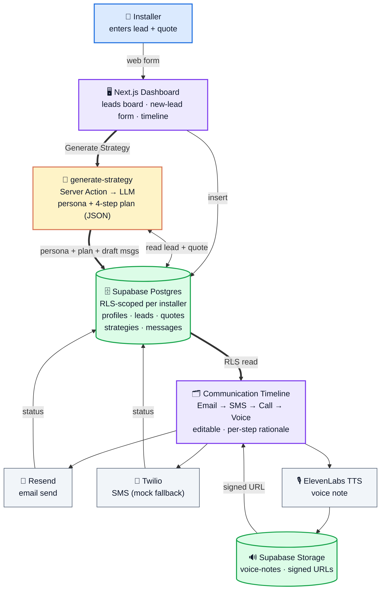

<p align="center">
  
</p>

# ☀️ AI Sales Copilot for Solar Installers

> **Track:** Reonic — *AI-Powered Marketing to Enable Renewable Installers*
> **Event:** {Tech:Europe} AI × Energy Hackathon, Berlin · 20–21 June 2026
>
> We are **not** just generating emails. We turn a single solar **quote** into a
> personalized, **multi-channel closing strategy** — email → SMS → call → voice note —
> with the reasoning, timing, and editable controls an installer can trust and adapt.

> 🗄️ Pre-event research, the full idea exploration, and the war-room doc are archived
> at [`archive/README-warroom-archive.md`](./archive/README-warroom-archive.md).
> Track brief lives in [`TRACKS.md`](./TRACKS.md); full build spec in
> [`BUILD_SPEC.md`](./BUILD_SPEC.md).

---

## 🎯 The Brief, In One Line

Solar installers lose deals in the gap between **"quote sent"** and **"contract
signed."** Homeowners hesitate, get distracted, get competing offers. Installers have
no time to personalize follow-up at scale, and generic templates don't move the
needle. **Our product reads the customer + quote, detects the persona, and produces a
coherent follow-up strategy** — *why this message, in this tone, on this channel, at
this time* — that the installer can preview, edit, and fire off.

The four personas the brief calls out, which our persona engine maps onto directly:

| Persona | What they need | How the strategy adapts |
|---|---|---|
| **Family** | Reassurance, peace of mind | "Predictable bills, no surprises," warm tone, references to other families nearby |
| **Investor** | Hard ROI, comparisons | "13% annual return vs. the stock market," payback tables, numbers-first |
| **Environmentalist** | Impact narrative | "Offset 150 t CO₂ over 25 years," mission framing |
| **Skeptic** | Objection handling | "Yes, panels work in winter too," proof points, low-pressure |

---

## 🌅 The Vision

Reonic gives installers a beautiful funnel — address → 3D house → PV/battery/heat-pump
sizing → a polished offer PDF. **Then the offer is sent, and the funnel goes quiet.**
The single most expensive moment in a solar sale is the silence *after* the quote: the
homeowner is comparing three offers, half-forgetting yours, and the installer — a
small team already booked solid on rooftops — has no time to chase each lead with a
personal, persuasive, well-timed follow-up.

Our product is the **closing layer** that sits on top of that quote. It reads the
homeowner and their numbers, recognizes *who they are* and *what would actually move
them*, and hands the installer a complete, multi-channel persuasion strategy — email,
SMS, a call script, and a personalized voice note — each step annotated with **why it
exists, in what tone, and when to send it.** The installer stays in control: every
message is editable, every rationale is visible. The AI proposes; the human disposes.

**The insight:** generic follow-up templates don't lose deals because they're badly
written — they lose deals because a family and an investor need to hear *completely
different things*, and no installer has time to write four bespoke sequences per lead.
We make persona-tailored, reasoning-backed follow-up a one-click action.

---

## 🧠 How It Works

1. **Installer enters the lead.** A "New Lead" form captures the homeowner (name,
   address, roof type, current monthly bill) and the solar quote (system size in kW,
   total cost, financing type, notes). Saved to Supabase under that installer only.
2. **The AI reads the whole picture.** A Server Action pulls the lead + quote and
   sends them to the LLM with a strict JSON-schema prompt.
3. **Persona detection.** The model classifies the homeowner into exactly one of the
   brief's four archetypes — **family · investor · environmentalist · skeptic** — and
   states *why*, grounded in the actual data (e.g. a high bill + investor language →
   payback-first framing).
4. **Strategy generation.** It emits a coherent **4-step, multi-channel** plan —
   Email → SMS → Call script → Voice-note script — and for **each** step a
   `timingHint`, a `rationale` (why this channel, this tone, now, for *this* persona),
   and the message body itself.
5. **Visual timeline.** The plan renders as an interactive vertical timeline. Each
   step is a preview card showing its content, its reasoning, and its status — and is
   **click-to-edit** before anything is sent.
6. **One-click execution.** Email fires via Resend, SMS via Twilio, and the voice note
   is synthesized by **ElevenLabs**, stored in Supabase Storage, and played back inline
   from a signed URL. Every send updates the message status, fully audited in the DB.

The output isn't "here are four emails." It's *"here is the approach, here is why it
fits this customer, and here is how you can adjust it"* — a persuasion strategy an
installer can understand, trust, and iterate on.

---

## 🏛️ Architecture



Every table is scoped by `installer_id = auth.uid()` through Row Level Security, so an
installer only ever sees their own leads — the multi-tenant B2B-SaaS shape that answers
the "could this be a company?" question directly. Full schema and execution order live
in [`BUILD_SPEC.md`](./BUILD_SPEC.md).

---

## 🧱 Tech Stack

> 🏗️ **Production architecture** — this is built as a real, multi-tenant B2B SaaS
> (secure, scalable), not a localStorage demo. Full spec in
> [`BUILD_SPEC.md`](./BUILD_SPEC.md).

| Layer | Choice |
|---|---|
| **Framework** | Next.js 14+ (App Router), TypeScript, React Server Components |
| **UI** | Tailwind CSS + shadcn/ui + Lucide icons (premium SaaS look) |
| **Database & Auth** | **Supabase** — PostgreSQL, Auth, Storage, **Row Level Security** |
| **AI** | Vercel AI SDK → OpenAI / Gemini |
| **Data fetching** | TanStack Query (React Query) or Server Actions |
| **Email** | Resend |
| **SMS** | Twilio (with mock fallback) |
| **Voice note** | ElevenLabs TTS → stored in Supabase Storage (signed URLs) |
| **Toasts** | `sonner` |
| **Deploy** | Vercel |

> 💡 The ElevenLabs voice note also enters us into the **Best Use of Eleven Labs**
> side challenge (6 months Scale tier, ~$1,980/member).
> 🔐 **RLS means installers only ever see their own leads** — the multi-tenant story
> that answers Point Nine's "could this be a company?"

---

## 🧩 Database Schema (Supabase, Phase 1)

Six objects, with **Row Level Security** so each installer only sees their own data.
Full SQL migration is generated first (see `BUILD_SPEC.md` execution order); shape:

| Table | Key columns |
|---|---|
| `profiles` | `id uuid → auth.users`, `company_name`, `created_at` |
| `leads` | `id`, `installer_id → profiles`, `name`, `email`, `phone`, `address`, `roof_type`, `monthly_bill`, `status` (default `new`), `created_at` |
| `quotes` | `id`, `lead_id → leads`, `system_size_kw`, `total_cost`, `financing_type`, `notes` |
| `strategies` | `id`, `lead_id → leads`, `persona_detected`, `strategy_summary`, `created_at` |
| `messages` | `id`, `lead_id`, `strategy_id`, `channel_type` ∈ {email,sms,call,voice}, `content`, `audio_url`, `status` ∈ {draft,sent,failed}, `sent_at`, `error_message` |
| **Storage** | bucket `voice-notes` — **private**, owner-only via signed URLs |

RLS policy pattern: every table scoped through `installer_id = auth.uid()` (directly on
`leads`, transitively via `lead_id` on `quotes`/`strategies`/`messages`). The persona
enum on `strategies.persona_detected` maps to the brief's four archetypes.

---

## 🚀 Features → Implementation

Five features in the brief, each mapped to what we actually build on the Supabase stack.

### 1. Dashboard
Sidebar nav (Dashboard · Leads · Settings) + main area = **Kanban board or data table
of `leads`** (Linear/Vercel dark aesthetic), each card showing name, system size, €,
persona badge, and `status`. Server Components read from Supabase (RLS-scoped).
- `app/(app)/dashboard/page.tsx` · `components/sidebar.tsx` · `components/lead-card.tsx`

### 2. Data Entry Forms
A **"New Lead"** modal/page with two sections, saving to `leads` + `quotes`:
- **Homeowner Info** — name, address, email, phone, roof type, monthly bill
- **Solar Quote Info** — system size (kW), total cost, financing type, notes
- shadcn `Form` + `Input` + `Select`; submit via a Server Action that inserts to DB.
- `app/(app)/leads/new/page.tsx` · `components/new-lead-form.tsx`

### 3. AI Strategy Generator (the core)
A **Server Action** `app/actions/generate-strategy.ts` fetches the lead + quote from
Supabase, calls Gemini/OpenAI via the Vercel AI SDK with a **strict JSON-schema
prompt**, then persists the result into `strategies` (+ draft rows in `messages`).

The prompt is the heart of the product — it must (a) **detect the persona from the
brief's four archetypes** (not freelance ones), (b) explain *why*, and (c) emit a
4-step plan with per-step rationale and timing:

```
SYSTEM: You are an expert solar sales closer. You receive a homeowner profile and a
solar quote. Do two things:
1. Classify the homeowner into exactly ONE persona: family | investor |
   environmentalist | skeptic. Briefly justify the classification from the data.
2. Produce a coherent 4-step, multi-channel follow-up strategy to move them from
   "quote received" to "contract signed" — WITHOUT being pushy.
   Steps, in order: 1) Email  2) SMS  3) Call script  4) Voice-note script.
   For EACH step give: timingHint, rationale (why this channel/tone/now for THIS
   persona), and the message body (email also has a subject; call/voice are scripts).
Tone, ROI framing, and objection-handling MUST match the detected persona.
Output STRICTLY as JSON matching the strategy schema. No prose outside JSON.
```

- Validate with `zod` before the DB insert. UI shows a **skeleton loader** while it runs.
- Constraining persona to the enum is what makes the output map onto the judges'
  exact language and keeps the "why" legible.

### 4. Communication Timeline & Previews
A vertical **timeline** of the 4 steps (Email → SMS → Call → Voice), read from
`messages`. Each step is a preview card showing its content + status, and is
**click-to-expand and editable** before sending:
- **Email** — subject + body, `Send via Resend` button
- **SMS** — text, `Send via Twilio` button
- **Call** — structured script (Opening · Value Prop · Objection Handling · Close)
- **Voice Note** — `Generate Voice` button → custom audio player streaming from Storage
- `components/timeline.tsx` · `components/step-card.tsx` (edits saved back to `messages`)

### 5. Sending & Voice Pipeline (Server Actions)
- **ElevenLabs** — `app/actions/generate-voice-note.ts`: fetch the voice script from
  `messages` → call TTS (`https://api.elevenlabs.io/v1/text-to-speech/{voice_id}`) →
  convert the audio stream to a **Blob** → upload to Supabase Storage `voice-notes` as
  `{message_id}.mp3` → get a **signed URL** → update `messages.audio_url` + `status='draft'`.
  Player streams the MP3 via the signed URL.
- **Resend** — `send-email` Server Action sends the (possibly edited) body; updates
  `messages.status` to `sent`/`failed` from the API response.
- **Twilio** — `send-sms` Server Action; updates DB status; **mock fallback** if
  `TWILIO_AUTH_TOKEN` is missing, so the demo never hard-fails without a paid number.
- Every Server Action wraps in try/catch and returns `{ error: string }`; buttons show
  spinners while pending; `sonner` toasts on success/failure.

---

## 🗺️ Build Order (the 27-hour path)

Production execution order — but **demo wow-path first** if time tightens (see below).

| Step | What |
|---|---|
| **1 — SQL schema** | Generate the full Supabase migration (6 tables/objects) + **RLS policies** |
| **2 — Project + middleware** | Next.js structure; `utils/supabase/{client,server,middleware}.ts` for cookie/session |
| **3 — Auth** | Login/Signup (shadcn forms or `@supabase/auth-ui-react`); protected routes |
| **4 — Lead/Quote forms** | New Lead flow → insert to `leads` + `quotes` |
| **5 — AI Strategy** | `generate-strategy` Server Action → `strategies` + draft `messages` |
| **6 — Voice pipeline** | ElevenLabs → Blob → Supabase Storage → signed URL → `messages.audio_url` |
| **7 — Timeline UI** | Preview + edit + send the messages (Resend / Twilio) |

> Install: `@supabase/supabase-js`, `@supabase/ssr` early (step 2). Write
> production-clean, commented code, but protect the **happy path** for the Sunday-14:00
> demo. Freeze features Sunday ~11:00 and spend the rest on polish + the pitch.

---

## 🎬 Demo Flow Checklist (this is the script)

- [ ] Installer enters homeowner + quote data
- [ ] Clicks **Generate Strategy**
- [ ] AI **detects the persona** and generates the 4-channel plan (streamed in live)
- [ ] App shows the **visual timeline** with per-step *why*
- [ ] Installer clicks **Send Email** → Resend
- [ ] Installer clicks **Send SMS** → Twilio (or mock toast)
- [ ] Installer reads the **Call script**
- [ ] Installer clicks **Generate Voice Note** → ElevenLabs → **plays the audio**

### 🛟 Demo-day insurance
- **Pre-generate & cache one voice note** for the demo lead; run the live ElevenLabs
  call as the show, but have the cached file ready if venue wifi flakes.
- Keep a **recorded fallback video** of the full flow.
- Ensure **loading skeletons** during strategy generation and audio render — the wait
  is part of the UX, not a dead screen.

---

## 🧪 UX/UI Rules

- Modern, **dark-mode-friendly SaaS** aesthetic (Linear / Vercel dashboard).
- `lucide-react` icons · `sonner` toasts ("Email sent", "Voice note generated").
- **Skeletons** while the AI or ElevenLabs is working.
- Timeline steps are **interactive** — click to expand and **edit the AI's text**
  before sending. The installer stays in control; the AI proposes, they dispose.

---

## 🔑 Environment Variables

```bash
# Supabase
NEXT_PUBLIC_SUPABASE_URL=
NEXT_PUBLIC_SUPABASE_ANON_KEY=
SUPABASE_SERVICE_ROLE_KEY=
# AI
OPENAI_API_KEY=
# Voice
ELEVENLABS_API_KEY=
ELEVENLABS_VOICE_ID=
# Email
RESEND_API_KEY=
# SMS (if absent, SMS is mocked)
TWILIO_ACCOUNT_SID=
TWILIO_AUTH_TOKEN=
TWILIO_PHONE_NUMBER=
```

Copy `.env.local` from the template. The app degrades gracefully when an integration
key is missing (SMS mocks; voice/email show a clear toast) so the demo never hard-fails.
The `SUPABASE_SERVICE_ROLE_KEY` is server-only — never expose it to the client.

---

## 🏷️ Product Name

Working title: **TBD** — shortlist candidates collected from team brainstorm
(e.g. *Momentum, Cadence, Cloze, Chorus, Tailwind, Wingman, Closeline*). Drop your
vote in `#team` or open a PR editing this line.

---

## 📊 By the Numbers — What We're Building

> A ~27-hour build window. One production-shaped B2B SaaS, not a throwaway demo.

- **4 personas** — `family` · `investor` · `environmentalist` · `skeptic`, a closed
  enum the AI must classify into (so the output speaks the judges' exact language)
- **4 channels per strategy** — Email → SMS → Call script → Voice note, each with its
  own timing and rationale
- **6 data objects** — `profiles`, `leads`, `quotes`, `strategies`, `messages` + a
  private `voice-notes` storage bucket, all **Row-Level-Security scoped per installer**
- **1 JSON-schema-constrained prompt** — persona detection + 4-step plan + per-step
  `timingHint` and `rationale`, validated with `zod` before it ever touches the DB
- **3 live integrations** — Resend (email), Twilio (SMS, with graceful mock fallback),
  ElevenLabs (voice) — every send audited in `messages.status`
- **2 example customer profiles** demoed end-to-end (a family and an investor) to show
  the variety the brief asks for
- **1 side-challenge entry** — the ElevenLabs voice note also competes for **Best Use
  of Eleven Labs** (6 months Scale tier, ~$1,980/member)

---

## 🎯 How It Maps to the Brief

- **Solves the brief's actual problem** — the gap between "quote sent" and "contract
  signed," addressed with strategy and reasoning, not a template dump.
- **Strategically sound** — persona-grounded follow-up, with the *why* visible at every
  step, exactly what the judges said they'd reward.
- **Visually compelling & iterative** — an editable timeline an installer would show
  their sales manager; the installer tweaks tone, timing, and copy on the fly.
- **Multi-channel by default** — email, SMS, call, and voice in one strategy (hitting
  the brief's bonus criteria, not just the baseline).
- **Believably a company** — multi-tenant, RLS-secured, production-shaped — the answer
  to "could this be a real product?" with Point Nine in the room.
- **Partner fit** — it bolts directly onto Reonic's existing funnel, picking up exactly
  where their offer PDF leaves off and turning more of those offers into signed deals.

---

## 👥 Team

Built at the {Tech:Europe} AI × Energy Hackathon in Berlin, 20–21 June 2026.

### Ian Baumeister — Product, Strategy & Full-Stack Build

[GitHub `@ibxibx`](https://github.com/ibxibx) · [ianworks.dev](https://ianworks.dev) · Berlin, DE

Solo developer and founder with a background spanning real estate, travel-tech, and
marketing operations — a track record of building startups at the intersection of
physical space and digital product. For this project: product vision, system
architecture, the Supabase + Next.js build, the persona/strategy prompt design, and the
hackathon pitch.

> _Teammates: open a PR adding your name, role, and links here._

---

## 📂 Repo Map

```
README.md            ← you are here (live build plan)
BUILD_SPEC.md        ← Leonardo's production spec (Supabase, RLS, Server Actions)
TRACKS.md            ← all hackathon tracks, side challenges, prizes
archive/             ← pre-event war room + research trail
reonic-research/     ← deep research on Reonic (background)
team-formation/      ← teammate outreach playbook
prep/                ← credits, pitch template, demo data sources
pics/                ← assets
```

---

*Let's turn quotes into contracts. ☀️*
